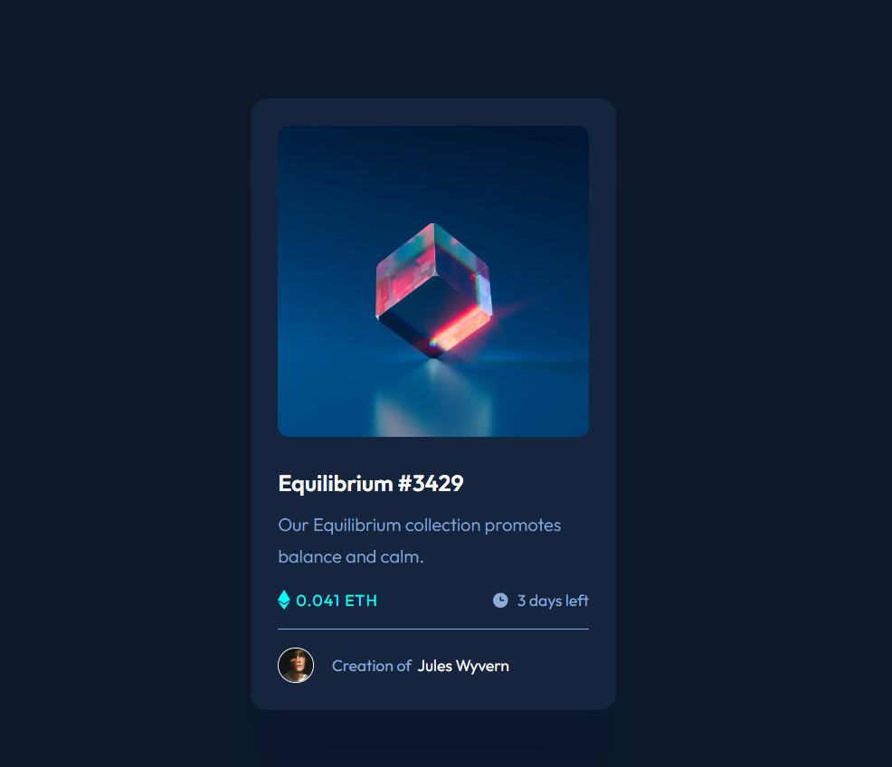
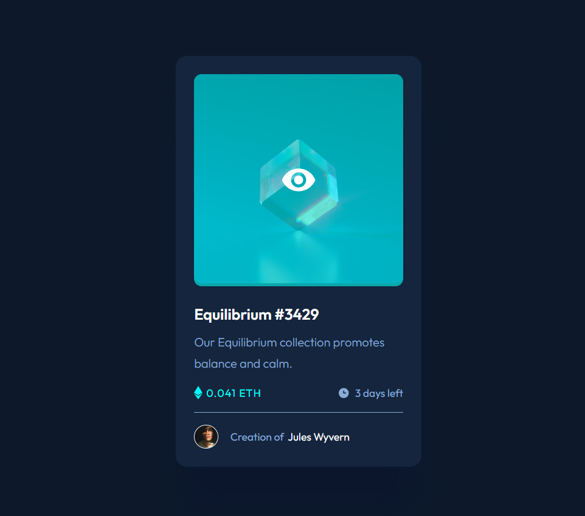

# Frontend Mentor - NFT preview card component solution

This is a solution to the [NFT preview card component challenge on Frontend Mentor](https://www.frontendmentor.io/challenges/nft-preview-card-component-SbdUL_w0U). Frontend Mentor challenges help you improve your coding skills by building realistic projects. 

## Table of contents

- [Overview](#overview)
  - [The challenge](#the-challenge)
  - [Screenshot](#screenshot)
  - [Links](#links)
- [My process](#my-process)
  - [Built with](#built-with)
  - [What I learned](#what-i-learned)
  - [Continued development](#continued-development)
- [Author](#author)
- [Acknowledgments](#acknowledgments)

## Overview
This project is a simple demonstration of creating stylish and responsive cards using HTML and CSS. Cards are a common UI component used in web development for displaying information in a visually appealing way. In this project,The primary goal is to construct a preview card component, You can use any tools you like to help you complete the challenge. So if you've got something you'd like to practice, feel free to give it a go.

### The challenge

Users should be able to:

- View the optimal layout depending on their device's screen size
- See hover states for interactive elements

### Screenshot

### Links

- Solution URL: [Add solution URL here](https://your-solution-url.com)
- Live Site URL: [Add live site URL here](https://your-live-site-url.com)

## My process

### Built with

- Semantic HTML5 markup
- CSS custom properties
- Flexbox
- Desktop-first workflow
### What I learned

This project served as a practical exploration and application of HTML and CSS skills, showcasing the ability to create a visually appealing card component. Given a foundational understanding of HTML and CSS, the focus was on refining existing knowledge and implementing best practices in web development.

### Continued development

As a frontend developer, the journey of continual learning is fundamental to staying relevant and mastering the ever-evolving landscape of web development. The completion of the simple CSS and HTML card project served as a stepping stone, revealing areas for improvement and growth. This section outlines the ongoing learning objectives and areas of focus to enhance proficiency and expertise.

### Useful resources

## Author

- Website - [https://parykhanjameel.netlify.app/]
- Frontend Mentor - [@parykhan-jamee]
- Twitter - [@Pmeeraziz]

## Acknowledgments

I really thank Forntend mentor for providing these challenges for us frontend developers to imporve our design skills.

